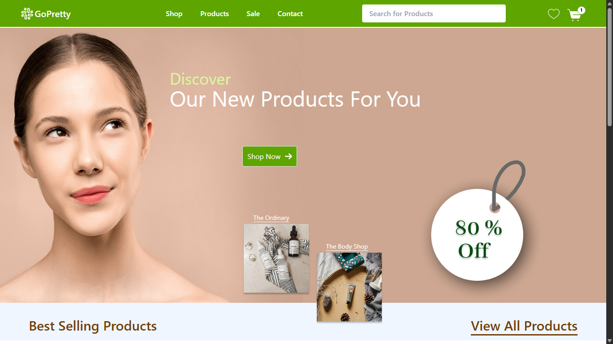

# 🌸 GoPretty - Your Skin Partner

Welcome to **GoPretty**, a modern and responsive e-commerce web app for skincare and beauty products. Built with **React**, **Vite**, and **Tailwind CSS**, GoPretty offers a seamless shopping experience with a beautiful UI and smooth interactions.

---


<p align="center">
    
</p>

## 🚀 Features

- **Modern UI**: Clean, attractive, and responsive design.
- **Top Brands**: Explore best-selling brands and their offers.
- **New Arrivals**: Stay updated with the latest products.
- **Best Sellers**: Discover the most popular items.
- **Interactive Cards**: Hover and click for engaging product previews.
- **Search Bar**: Quickly find your favorite products.
- **Cart & Wishlist**: Add products to your cart or wishlist.
- **Mobile Friendly**: Fully responsive for all devices.

---

## 🖥️ Tech Stack

- [React](https://react.dev/)
- [Vite](https://vitejs.dev/)
- [Tailwind CSS](https://tailwindcss.com/)
- [ESLint](https://eslint.org/) (with React Hooks & Refresh plugins)

---

## 📦 Getting Started

1. **Clone the repository**
   ```sh
   git clone https://github.com/ishwar-meena/gopretty.git
   cd gopretty